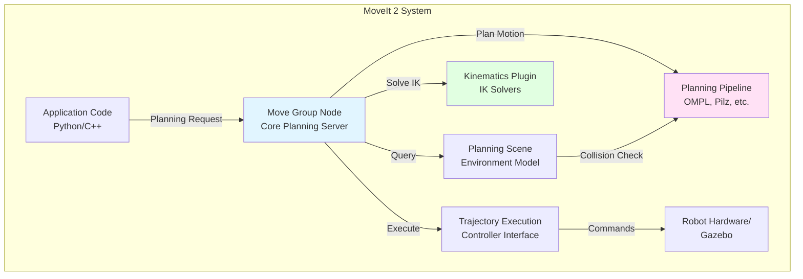

# Chapter 3.1: Motion Planning Overview

## Learning Objectives

By the end of this chapter, you will be able to:

1. Explain what motion planning is and why it's essential for robotic manipulation
2. Identify the key components of MoveIt 2 architecture
3. Understand the difference between forward/inverse kinematics and trajectory planning
4. Recognize when to use sampling-based vs optimization-based planners

## Prerequisites

### Required Knowledge
- ROS 2 fundamentals (nodes, topics, services, actions)
- URDF robot modeling
- Basic linear algebra (vectors, matrices, transformations)
- Understanding of robot kinematics concepts

### Previous Chapters
- [Module 1: ROS 2 Foundation](../module1/overview.md) - ROS 2 ecosystem and URDF
- [Module 2: Digital Twin](../module2/overview.md) - Simulation and Gazebo

## Content

### What is Motion Planning?

**Motion planning** is the computational problem of finding a sequence of valid configurations that moves a robot from a start state to a goal state while satisfying constraints (collision avoidance, joint limits, smoothness).

For humanoid robots, motion planning addresses questions like:
- How can the robot reach for an object on a shelf without hitting obstacles?
- What joint trajectory minimizes energy while walking from point A to B?
- Can the robot grasp a cup without colliding its arm with a table?

**The Challenge**: For a 7-DOF humanoid arm, the configuration space has 7 dimensions. Finding collision-free paths in high-dimensional spaces is computationally hard (PSPACE-hard complexity class). Naive grid-based search is infeasible—discretizing each joint into 100 values creates 100^7 = 100 trillion states to explore.

**The Solution**: Modern motion planners use sampling-based algorithms (RRT, RRT*, PRM) that probabilistically explore the configuration space, or optimization-based methods (TrajOpt, CHOMP) that iteratively refine initial trajectories.

### Why MoveIt 2?

**MoveIt 2** is the industry-standard motion planning framework for ROS 2. It integrates multiple planning libraries (OMPL, Pilz, TrajOpt), collision checking (FCL), kinematics solvers (KDL, TRAC-IK), and provides a unified interface for robotic manipulation.

**Key Benefits**:
1. **Plug-and-Play Planners**: Switch between RRT, RRT*, PRM, CHOMP without changing application code
2. **Hardware Abstraction**: Same planning interface works for different robot arms (UR5, Panda, custom humanoid arms)
3. **Collision Checking**: Fast FCL library checks millions of collision queries per second
4. **Ecosystem Integration**: Works seamlessly with Gazebo, RViz, and robot controllers

**Real-World Usage**: Companies like Amazon Robotics, ABB, and Toyota use MoveIt for industrial manipulation. Boston Dynamics uses similar planning algorithms for Atlas arm control.

### Core Motion Planning Concepts

#### 1. Configuration Space (C-Space)

The **configuration space** represents all possible robot states. For an n-DOF robot, C-space is an n-dimensional manifold.

- **Free Space (C_free)**: Configurations where robot doesn't collide with obstacles
- **Obstacle Space (C_obs)**: Configurations in collision
- **Goal**: Find path in C_free connecting start and goal configurations

**Example**: For a 3-DOF planar arm, C-space is 3D (joint angles θ1, θ2, θ3). A collision with a table manifests as a forbidden region in C-space.

#### 2. Forward vs Inverse Kinematics

**Forward Kinematics (FK)**: Given joint angles → compute end-effector pose
- Input: [θ1, θ2, ..., θn]
- Output: End-effector position (x, y, z) and orientation (quaternion)
- **Always has unique solution**

**Inverse Kinematics (IK)**: Given end-effector pose → compute joint angles
- Input: Target position/orientation
- Output: Joint angles that achieve that pose
- **May have 0, 1, or infinite solutions**
- Challenging for redundant manipulators (7+ DOF arms)

**IK Solvers**:
- **Analytical**: Closed-form solutions (fast but only exist for specific geometries)
- **Numerical**: Iterative optimization (KDL, TRAC-IK, IKFast)

#### 3. Trajectory Planning

Motion planning finds a **path** (sequence of configurations). Trajectory planning adds **timing information** (velocity, acceleration) to make paths executable.

**Requirements**:
- Respect joint velocity/acceleration limits
- Smooth motion (avoid jerky movements that stress actuators)
- Minimize execution time

**Common Approaches**:
- **Cubic/Quintic Splines**: Interpolate path points with smooth polynomials
- **Time Parameterization**: Compute fastest trajectory along path respecting velocity/acceleration limits

### MoveIt 2 Architecture

**Diagram**: MoveIt 2 architecture showing data flow from planning request to execution.

**Key Components**:
- **Move Group**: Central planning server exposing action interfaces
- **Planning Scene**: Maintains robot state, obstacle geometry, allowed collision matrix
- **Kinematics Plugin**: Solves IK for target poses
- **Planning Pipeline**: Connects planners, adapters (fix start state, time parameterization)

### Common Planning Algorithms

#### Sampling-Based Planners (OMPL Library)

**RRT (Rapidly-Exploring Random Tree)**:
- Grows tree from start by random sampling
- Fast but paths are jerky
- Probabilistically complete (finds solution if one exists, given infinite time)

**RRT\* (Optimal RRT)**:
- Rewires tree to improve path quality
- Asymptotically optimal (converges to shortest path)
- Slower than RRT but produces smoother paths

**PRM (Probabilistic Roadmap)**:
- Preprocessing: Build roadmap of valid configurations
- Query: Connect start/goal to roadmap and search
- Good for repeated planning in same environment

#### Optimization-Based Planners

**CHOMP (Covariant Hamiltonian Optimization)**:
- Optimizes initial trajectory to minimize cost (obstacle distance, smoothness)
- Fast but can get stuck in local minima
- Works well when initial guess is roughly collision-free

**TrajOpt**:
- Formulates planning as nonlinear optimization problem
- Minimizes cost subject to collision constraints
- Better convergence than CHOMP but computationally heavier

### Motion Planning for Humanoids

Humanoid manipulation adds complexity:

1. **Redundancy**: 7-DOF arms have infinite IK solutions for given pose → planner must choose optimal configuration
2. **Whole-Body Planning**: Reaching far objects requires coordinating arm + torso motion
3. **Balance Constraints**: Manipulation must not destabilize bipedal stance
4. **Dual-Arm Coordination**: Bimanual tasks require synchronized planning

**Solutions**:
- Use redundancy resolution (null-space optimization) to prefer configurations that maximize manipulability
- Integrate whole-body IK solvers that consider stability
- Plan in task space (Cartesian trajectories) rather than joint space for intuitive motion

## Summary

### Key Takeaways
- **Motion planning** finds collision-free paths in high-dimensional configuration spaces
- **MoveIt 2** provides unified interface for planning libraries, IK solvers, and trajectory execution
- **Forward kinematics** (joints → pose) always has unique solution; **inverse kinematics** (pose → joints) may have 0, 1, or infinite solutions
- **Sampling-based planners** (RRT, PRM) probabilistically explore C-space; **optimization-based planners** (CHOMP, TrajOpt) refine trajectories
- **Humanoid manipulation** requires handling redundancy, whole-body coordination, and balance constraints

### What's Next
In Chapter 3.2, you'll install MoveIt 2 and configure it for a humanoid arm using the Setup Assistant.

## Exercises

None for this introductory chapter. Move on to Chapter 3.2 to begin hands-on installation.

## References

- Chitta, S., Sucan, I., & Cousins, S. (2012). MoveIt! [ROS Topics]. *IEEE Robotics & Automation Magazine*, 19(1), 18-19. https://doi.org/10.1109/MRA.2011.2181749
- Kavraki, L. E., Svestka, P., Latombe, J. C., & Overmars, M. H. (1996). Probabilistic roadmaps for path planning in high-dimensional configuration spaces. *IEEE Transactions on Robotics and Automation*, 12(4), 566-580.
- LaValle, S. M., & Kuffner, J. J. (2001). Rapidly-exploring random trees: Progress and prospects. *Algorithmic and Computational Robotics: New Directions*, 293-308.

---

**Word Count**: ~600 words
