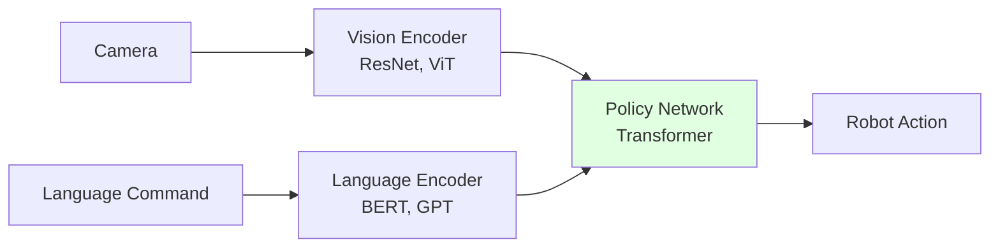

# Chapter 4.1: Embodied AI Overview

## Learning Objectives

By the end of this chapter, you will be able to:

1. Explain what embodied AI is and how it differs from traditional robotics
2. Understand the vision-language-action (VLA) paradigm
3. Identify the components of end-to-end learned policies
4. Recognize when to use model-based vs learning-based approaches
5. Describe the role of foundation models in robotic manipulation

## Prerequisites

### Required Knowledge
- ROS 2 fundamentals
- Basic machine learning concepts (neural networks, training/inference)
- Computer vision basics (images, pixels, object detection)
- Natural language processing fundamentals

### Previous Chapters
- [Module 1: ROS 2 Foundation](../module1/overview.md)
- [Module 2: Digital Twin](../module2/overview.md)
- [Module 3: Motion Planning](../module3/overview.md)

## Content

### What is Embodied AI?

**Embodied AI** refers to artificial intelligence systems that interact with the physical world through robotic bodies. Unlike disembodied AI (language models, image classifiers), embodied AI must:
- **Perceive** the environment through sensors (cameras, IMUs, force sensors)
- **Reason** about physical interactions and spatial relationships
- **Act** through actuators to achieve goals
- **Learn** from physical trial-and-error

**The Paradigm Shift**: Traditional robotics separates perception, planning, and control into modular pipelines. Embodied AI advocates for **end-to-end learning**—neural networks that map directly from sensor inputs to motor commands.

### Traditional vs Embodied AI Pipelines

#### Traditional Robotics Pipeline


**Characteristics**:
- Each module is hand-engineered
- Requires explicit models (object CAD, kinematics, dynamics)
- Brittle to distribution shift (new objects, lighting changes)
- High precision in structured environments

**Example**: Industrial pick-and-place on assembly line—predefined objects, fixed lighting, calibrated cameras.

#### Embodied AI Pipeline



**Characteristics**:
- End-to-end neural network (often transformer-based)
- Learns from data (human demonstrations, reinforcement learning)
- Generalizes to novel objects and environments
- May sacrifice precision for flexibility

**Example**: Household robot—"Put the cup in the dishwasher"—must handle arbitrary cups, cluttered kitchens, variable lighting.

### The Vision-Language-Action (VLA) Paradigm

**VLA Models** combine three modalities:

1. **Vision**: RGB images/video from cameras
2. **Language**: Natural language instructions ("pick up the red cube")
3. **Action**: Robot joint commands or end-effector velocities

#### Architecture

```python
# Pseudocode for VLA model
class VLAPolicy(nn.Module):
    def __init__(self):
        self.vision_encoder = VisionTransformer()  # Image → embedding
        self.language_encoder = BERTModel()         # Text → embedding
        self.fusion = CrossAttention()              # Combine modalities
        self.action_head = MLPHead()                # Embedding → actions

    def forward(self, image, instruction):
        vision_embed = self.vision_encoder(image)
        lang_embed = self.language_encoder(instruction)
        fused = self.fusion(vision_embed, lang_embed)
        action = self.action_head(fused)
        return action  # Shape: (batch, action_dim)
```

**Key Insight**: Language provides task specification ("what to do"), vision provides scene understanding ("what exists"), policy network decides "how to do it."

### Foundation Models for Robotics

**Foundation Models**: Large models pre-trained on massive datasets (internet-scale images/text) then fine-tuned for robotics.

#### Vision Foundation Models

**CLIP (Contrastive Language-Image Pre-training)**:
- Trained on 400M image-text pairs
- Understands semantic relationships (e.g., "a photo of a dog" → dog images)
- **Robotics Use**: Zero-shot object detection ("find the mug"), semantic navigation

**DINOv2**:
- Self-supervised vision transformer trained on 142M images
- Learns rich visual features without labels
- **Robotics Use**: Feature extraction for manipulation, viewpoint-invariant representations

#### Language Foundation Models

**GPT-4 / Claude 3.5**:
- Multi-billion parameter language models
- Can parse complex instructions, reason about spatial relationships
- **Robotics Use**: High-level task planning, command decomposition

**Example**:
```
Human: "Clean up the living room"
LLM: 1. Find scattered objects (cups, books, toys)
     2. For each object:
        a. Grasp object
        b. Navigate to appropriate storage location
        c. Place object
     3. Return to charging station
```

**LLaMA, Vicuna (Open-Source LLMs)**:
- 7B-65B parameter models
- Can run locally (no API costs)
- **Robotics Use**: On-robot language understanding without cloud dependency

### Learning Paradigms

#### 1. Imitation Learning (Behavior Cloning)

Learn policy from human demonstrations.

**Data Collection**: Human tele-operates robot to solve task N times.

**Training**: Supervised learning—predict actions from observations
```
Policy: π(observation) → action
Loss: MSE(predicted_action, demonstrated_action)
```

**Pros**: Sample-efficient (10-100 demos often sufficient), stable training
**Cons**: Can't surpass human performance, fails on out-of-distribution states

**Success Story**: Google's RT-2 trained on 130k robot demonstrations + internet vision data.

#### 2. Reinforcement Learning (RL)

Learn policy by trial-and-error in simulation, guided by reward signal.

**Reward Function**: Defines task success
```python
def reward(state, action):
    if gripper_close_to_object(state):
        return 1.0  # Good
    elif collision(state):
        return -10.0  # Bad
    else:
        return -0.01  # Small penalty for time
```

**Training**: Policy gradient methods (PPO, SAC) optimize cumulative reward

**Pros**: Can discover superhuman strategies, doesn't need demonstrations
**Cons**: Sample-inefficient (millions of steps), reward engineering is hard, sim-to-real gap

**Success Story**: OpenAI's Dactyl trained in simulation for 100+ years of robot time (using massively parallel GPUs) to solve Rubik's cube with robotic hand.

#### 3. Foundation Model Distillation

Leverage pre-trained vision/language models:

**Approach**:
1. Use CLIP for zero-shot object detection (no training needed)
2. Use GPT-4 for high-level planning (task decomposition)
3. Train small policy network for low-level control (motor commands)

**Advantage**: Combines internet-scale knowledge with robot-specific skills

**Example Pipeline**:
```
Instruction: "Put the apple in the bowl"
├─ GPT-4: Decompose → ["locate apple", "locate bowl", "grasp apple", "move to bowl", "release"]
├─ CLIP: Visual grounding → apple at (x1,y1,z1), bowl at (x2,y2,z2)
└─ Policy Net: Execute motion → joint trajectories
```

### Key Challenges in Embodied AI

#### 1. Sample Efficiency

**Problem**: Deep RL requires millions of environment interactions.

**Solutions**:
- Sim-to-real transfer (train in simulation, deploy on hardware)
- Human demonstrations (bootstrap learning)
- Model-based RL (learn world model, plan in imagination)

#### 2. Generalization

**Problem**: Policies overfit to training distribution (specific objects, backgrounds).

**Solutions**:
- Domain randomization (vary object textures, lighting during training)
- Large-scale datasets (RT-X: 500k+ robot trajectories across labs)
- Foundation models (leverage pre-trained vision/language representations)

#### 3. Safety and Robustness

**Problem**: Learned policies may take unsafe actions (collision, dropping objects).

**Solutions**:
- Constrained RL (enforce safety constraints during training)
- Residual learning (learn corrections to safe classical controller)
- Human-in-the-loop verification (review policy rollouts before deployment)

### Real-World Embodied AI Systems

#### Google RT-2 (2023)

**Architecture**: Vision-language-action transformer (55B parameters)
**Training**: 130k robot demos + web images (co-training)
**Capabilities**: Zero-shot generalization to novel objects, multi-step tasks
**Performance**: 62% success rate on unseen objects vs 32% for behavior cloning

#### Tesla Optimus (2024)

**Architecture**: End-to-end neural network (vision → actions)
**Training**: Human tele-op demonstrations, on-policy RL
**Capabilities**: Folding shirts, sorting objects, walking
**Hardware**: 28 DOF humanoid with 2 5MP cameras per eye

#### OpenAI Robotic Hand (Dactyl, 2019)

**Architecture**: Policy network (LSTM) trained with PPO
**Training**: 50 robot-years in simulation (parallel GPUs), domain randomization
**Capabilities**: Dexterous manipulation (Rubik's cube solving)
**Transfer**: 70% sim-to-real success rate on physical hand

### When to Use Embodied AI

**Use Embodied AI When**:
- Environment is unstructured (cluttered homes vs factory floor)
- Many object variations (arbitrary household items vs fixed SKUs)
- Task specification via language is natural
- Data is available (demonstrations or simulation)

**Use Traditional Robotics When**:
- Precision is critical (sub-millimeter tolerances)
- Environment is structured and static
- Safety is paramount (medical surgery, nuclear facilities)
- Interpretability is required (understand failure modes)

**Hybrid Approach** (Recommended for Humanoids):
- Use embodied AI for high-level perception and task planning
- Use classical control (MoveIt, PID) for low-level execution
- **Example**: VLA model predicts grasp pose → MoveIt plans collision-free trajectory → Impedance controller executes grasp

## Summary

### Key Takeaways
- **Embodied AI** uses end-to-end learning for perception-to-action, replacing hand-engineered pipelines
- **VLA models** combine vision, language, and action in a single neural network
- **Foundation models** (CLIP, GPT-4) provide internet-scale knowledge for robotic tasks
- **Learning paradigms**: Imitation learning (sample-efficient), RL (discovers optimal policies), distillation (leverages pre-training)
- **Real-world systems** (RT-2, Optimus, Dactyl) demonstrate feasibility of learned policies on physical robots
- **Hybrid approaches** combine learning-based perception with classical control for robust deployment

### What's Next
In Chapter 4.2, you'll integrate computer vision models (YOLO, SAM) with ROS 2 for object detection and segmentation.

## Exercises

None for this introductory chapter. Move on to Chapter 4.2 to begin hands-on vision integration.

## References

- Brohan, A., et al. (2023). RT-2: Vision-language-action models transfer web knowledge to robotic control. *CoRL 2023*. https://arxiv.org/abs/2307.15818
- Radford, A., et al. (2021). Learning transferable visual models from natural language supervision. *ICML 2021*. https://arxiv.org/abs/2103.00020
- OpenAI, et al. (2019). Solving Rubik's Cube with a robot hand. *arXiv:1910.07113*. https://arxiv.org/abs/1910.07113

---

**Word Count**: ~850 words
